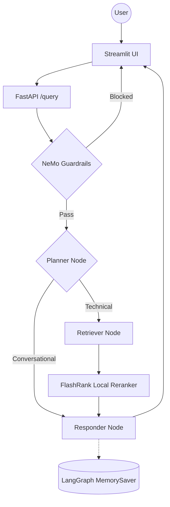

# Enterprise Agentic RAG (Scalable Pipeline)

A production-grade, enterprise-level RAG system built with **LangGraph**, **Portkey LLM Gateway**, and **Gemini Embeddings**. The system distinguishes between technical "True Data" and random "Noisy Data" using semantic re-ranking, history-aware planning, and NeMo Guardrails for input/output safety.

## Key Features

- **Agentic Intelligence**: LangGraph for cyclic reasoning, multi-step planning, and conversation memory.
- **Guardrails**: NeMo Guardrails gate blocks off-topic, jailbreak, and injection inputs before any retrieval.
- **LLM Gateway**: Portkey routes all LLM calls with automatic fallback between primary and backup Groq keys.
- **Enterprise Search**: Qdrant Cloud for high-performance vector search + FlashRank for local semantic reranking.
- **Gemini Embeddings**: Google `gemini-embedding-2-preview` (3072-dim) via `langchain-google-genai`.
- **Local Document Parsing**: PDF, HTML, TXT, DOCX, PPTX parsed entirely on-device — no external OCR service.
- **Observability**: Full trace nesting with **Pydantic Logfire** and **LangSmith** across every agent node.
- **Evaluation Suite**: RAGAS-powered eval pipeline (6 metrics) with a dedicated Streamlit demo app.

---

## Agent Intelligence Flow



---

## Project Structure

```text
├── app/
│   ├── agents/
│   │   └── nodes/       # Planner, Retriever, Responder LangGraph nodes
│   ├── gateway/         # Portkey LLM gateway — primary + fallback Groq routing
│   ├── guardrails/      # NeMo Guardrails input/output filtering
│   ├── ingestion/
│   │   ├── chunking/    # Paragraph-based text splitter (1500 char max)
│   │   └── loaders/     # Local parsers — PDF (pypdf), HTML, TXT, DOCX, PPTX
│   ├── services/
│   │   └── retrieval/   # Gemini embeddings + Qdrant search + FlashRank reranking
│   ├── config.py        # Centralized environment variable management
│   └── main.py          # FastAPI entrypoint — guardrails gate + /query endpoint
├── evals/               # RAGAS evaluation suite + Streamlit 3-tab demo
├── ui/                  # Streamlit chat interface with reasoning step transparency
├── DATA/                # Sample datasets (True vs Noisy documentation)
└── requirements.txt     # Pinned dependencies
```

---

## Tech Stack

| Layer | Technology |
|-------|-----------|
| Orchestration | LangChain + LangGraph |
| LLMs | Groq (Llama 3.3 70B) via **Portkey** gateway |
| Guardrails | NeMo Guardrails |
| Vector DB | Qdrant Cloud |
| Reranking | FlashRank (local, zero-latency) |
| Embeddings | Gemini `gemini-embedding-2-preview` (3072-dim) |
| Document Parsing | pypdf + pdfplumber (local, no OCR service) |
| Observability | Pydantic Logfire + LangSmith |
| Evaluation | RAGAS + custom Tool Correctness (Jaccard) |

---

## Getting Started

### 1. Install dependencies

```powershell
python -m venv tenvv
.\tenvv\Scripts\activate
pip install -r requirements.txt
```

### 2. Configure environment

Create a `.env` file from `.env.example` and fill in your keys. Local development can leave `APP_ENV=development`. For real users see **Before production** below.

```env
APP_ENV=development
GROQ_API_KEY=
PORTKEY_API_KEY=
QDRANT_API_KEY=
QDRANT_CLUSTER_ENDPOINT=
GEMINI_API_KEY=
BACKEND_URL=http://localhost:8000
```

### 3. Run data ingestion

Demo files live in `DATA/true_data` (and synthetic `DATA/noisy_data`). For real users, put documents in `DATA/production` and ingest only that folder:

```powershell
python -m app.ingestion.processor DATA/production --wipe
```

Local demo (skips `noisy_data` unless you pass `--include-noisy`):

```powershell
python -m app.ingestion.processor DATA --wipe
```

> `--wipe` drops and recreates the Qdrant collection named `QDRANT_COLLECTION`. Use a dedicated production collection name.

### 4. Launch the app

```powershell
# Terminal 1 — FastAPI backend
uvicorn app.main:app --reload --port 8000

# Terminal 2 — Streamlit UI
streamlit run ui/app.py
```

### 5. Run the eval suite (optional)

```powershell
# Requires the FastAPI backend running on :8000
streamlit run evals/app.py
```

---

## Before production

1. Set `APP_ENV=production`, a long random `API_KEY`, `APP_PASSWORD`, and `DEBUG_KEY` (evals only). Store them in Cloud Run / Secret Manager, not in the image.
2. Set `CHECKPOINT_BACKEND=redis` (`REDIS_URL`) or `postgres` (`DATABASE_URL`). In-memory memory is rejected in production.
3. Set `BACKEND_URL` to the public HTTPS API. Streamlit Cloud: copy `.streamlit/secrets.toml.example`. Optional `CORS_ORIGINS` if a browser calls the API directly.
4. Ingest **your** docs into `DATA/production` with `--wipe` on a production Qdrant collection. Set `ASSISTANT_SCOPE` to match. Rebuild `evals/golden_dataset.json` for real questions.
5. Keep `LANGSMITH_TRACING=false` and `LOG_USER_CONTENT=false` unless you have vendor DPAs. Customize [legal/PRIVACY.md](legal/PRIVACY.md) and [legal/TERMS.md](legal/TERMS.md).
6. Cloud Run probes: `GET /health` (unauthenticated). `POST /query` requires `X-API-Key` and `X-User-Id`.

---
